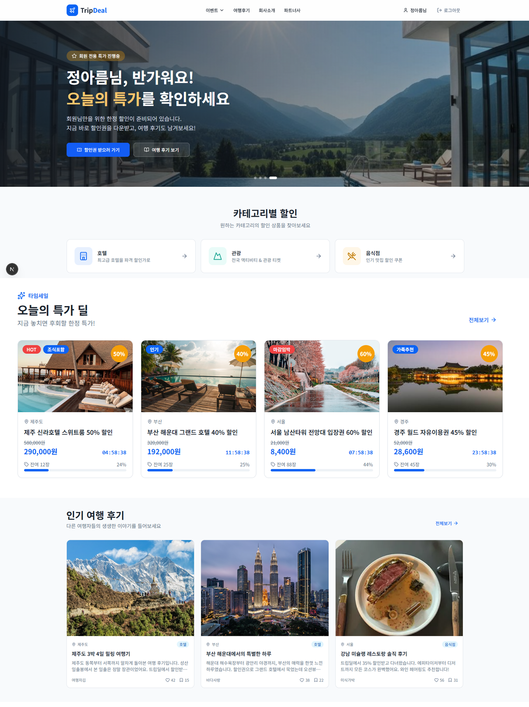
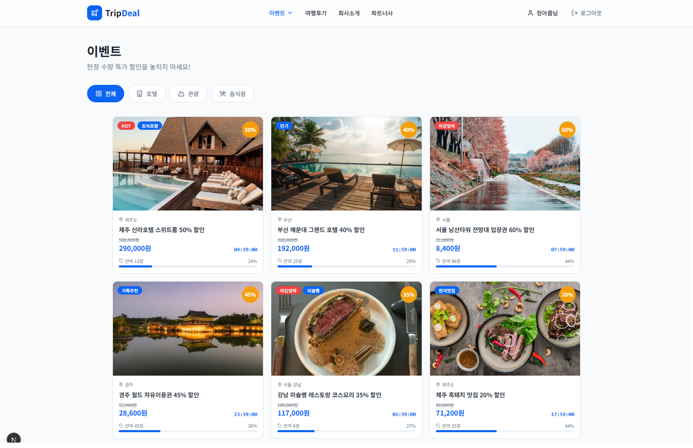
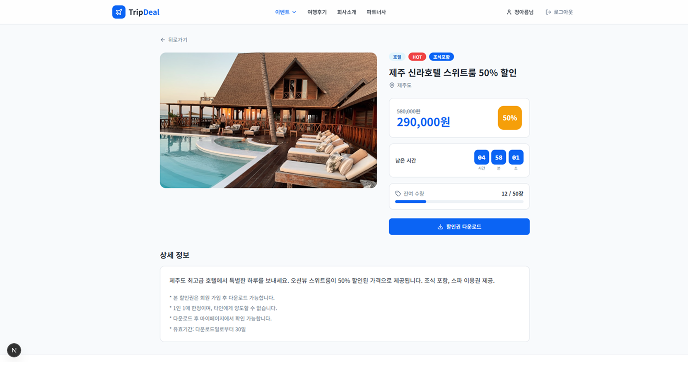

# ✈️ TripDeal

안정적인 여행 커뮤니티 및 타임세일 이벤트를 위한 고가용성 인프라 구축 프로젝트

단순한 기능 구현을 넘어, 특정 시즌(성수기)과 선착순 이벤트 시 발생하는 트래픽 폭증, 그리고 예상치 못한 서버 장애 상황에서도 서비스가 안정적으로 유지될 수 있도록 인프라를 설계, 구현 및 검증하는 프로젝트입니다.

---

## 📌 1. 프로젝트 개요 (Project Overview)

- **목적:** 평시/이벤트/장애 상황별 시나리오 기반 인프라 운영 및 검증
- **배경:** 여행 서비스 특성상 특정 시간대 트래픽 집중 및 서버 장애 시 발생하는 금전적 손실과 사용자 불만 해결 필요
- **핵심 목표:**
  - 💰 비용 효율성: 평시 최소 리소스로 서비스 운영
  - 🔒 고가용성: 트래픽 폭증 시 무중단 서비스 유지
  - ⚡ 신속한 대응: 로그 및 메트릭 기반의 빠른 장애 원인 분석

---

## 🖼️ 2. 서비스 화면 (Service Preview)

**🔹 주요 화면**

<table>
  <tr>
    <td align="center"><b>🏠 메인 페이지</b></td>
  </tr>
  <tr>
    <td></td>
  </tr>
  <tr>
    <td align="center"><b>⏰ 타임세일 이벤트</b></td>
  </tr>
  <tr>
    <td></td>
  </tr>
  <tr>
    <td align="center"><b>📝 여행 후기 커뮤니티</b></td>
  </tr>
  <tr>
    <td></td>
  </tr>
</table>

 

**🔹 전체 화면 구성 (UI Preview)**

<table>
  <tr>
    <td align="center"><b>🔐 회원가입</b></td>
    <td align="center"><b>📋 메인</b></td>
    <td align="center"><b>⏰ 이벤트목록</b></td>
  </tr>
  <tr>
    <td></td>
    <td></td>
    <td></td>
  </tr>
  <tr>
    <td align="center"><b>🎟️ 이벤트상세</b></td>
    <td align="center"><b>📝 여행후기목록</b></td>
    <td align="center"><b>✏️ 후기작성</b></td>
  </tr>
  <tr>
    <td></td>
    <td></td>
    <td></td>
  </tr>
    <tr>
    <td align="center"><b>🎫 쿠폰오픈 목록</b></td>
    <td align="center"><b>🎫 쿠폰오픈 상세1</b></td>
    <td align="center"><b>🎫 쿠폰오픈 상세2</b></td>
  </tr>
  <tr>
    <td></td>
    <td></td>
    <td></td>
  </tr>
  <tr>
    <td align="center"><b>📄 후기상세</b></td>
    <td align="center"><b>👤 마이페이지</b></td>
    <td align="center"><b>🏢 회사소개</b></td>
  </tr>
  <tr>
    <td></td>
    <td></td>
    <td></td>
  </tr>
  <tr>
    <td align="center"><b>🤝 파트너사</b></td>
    <td></td>
    <td></td>
  </tr>
  <tr>
    <td></td>
    <td></td>
    <td></td>
  </tr>
</table>
---

## 🛠️ 3. 기술 스택 (Tech Stack)

---

### 🔹 Infrastructure & Orchestration

| 영역 | 기술 | 설명 |
|------|------|------|
| OS | Linux (Ubuntu) | 서버 운영 표준 및 자동화 유용 |
| Virtualization | KVM | 실무와 유사한 VM 기반 인프라 구성 |
| Container | Docker | 환경 표준화 및 빠른 재현 |
| Orchestration | Kubernetes | HPA를 통한 자동 확장 및 장애 복구 |

---

### 🔹 Backend & Frontend

| 영역 | 기술 | 설명 |
|------|------|------|
| Backend | Spring Boot | 구조적 안정성 및 API 구성 |
| Frontend | Next.js | SSR 기반의 사용자 경험 및 퍼포먼스 최적화 |

---

### 🔹 CI/CD & Observability

| 영역 | 기술 | 설명 |
|------|------|------|
| CI/CD | GitLab CI/CD | 코드 변경 시 자동 빌드 및 배포 파이프라인 |
| Monitoring | Prometheus & Grafana | 리소스 상태 시각화 |
| Logging | Loki, Fluent Bit | 중앙 집중형 로그 관리 및 장애 추적 |

---

## 🚀 4. 운영 시나리오 및 검증 (Scenarios)

**시나리오 1: 평시 운영 (Baseline)**
- 내용: 여행 커뮤니티 게시글 조회/작성 및 낮은 트래픽 유지
- 목표: 최소 리소스로 비용 효율적인 운영 및 기본적인 모니터링 수행

**시나리오 2: 이벤트 트래픽 폭증 (Traffic Burst)**
- 내용: 오전 10시 선착순 할인 이벤트 시 대량의 동시 접속 발생 가정
- 목표: **HPA(Horizontal Pod Autoscaler)** 를 통해 트래픽 증가에 따른 Pod 자동 확장 및 무중단 유지

**시나리오 3: 장애 상황 (Failure Recovery)**
- 내용: 의도적인 Pod/Node 강제 종료 상황 부여
- 목표: Kubernetes의 자동 복구 기능 확인 및 Loki/Grafana를 통한 장애 원인 분석 능력 검증

---

## 🏗️ 5. 구현 범위 (Implementation Detail)

- **사용자 기능:** 회원가입/로그인, 여행 후기 조회/작성/좋아요/저장/댓글, 타임세일 이벤트 조회/할인권 다운로드, 마이페이지
- **인프라 구성:** KVM VM 구성 → Docker 컨테이너화 → K8s 클러스터 구축 (Ingress, Service, Deployment)
- **자동화:** GitLab Runner를 활용한 CI/CD 파이프라인 구축
- **검증:** 부하 테스트를 통한 인프라 안정성 최종 확인

---

## 📡 6. API 명세 (API Specification)

백엔드(`http://localhost:8080`)에서 제공하는 RESTful API 목록입니다.

**👤 회원 (Auth)**

| Method | Endpoint | Description | Request Body | Response (Success) |
|--------|----------|-------------|--------------|-------------------|
| POST | `/api/signup` | 회원가입 | `{"email": "...", "password": "...", "name": "..."}` | `{"message": "회원가입이 완료되었습니다."}` |
| POST | `/api/login` | 로그인 | `{"email": "...", "password": "..."}` | `{"id": 1, "name": "...", "email": "..."}` |

**⏰ 이벤트 (Event)**

| Method | Endpoint | Description | Request Body | Response (Success) |
|--------|----------|-------------|--------------|-------------------|
| GET | `/api/events` | 이벤트 목록 조회 | - | `[{"id": 1, "title": "...", "discountRate": 50, "remainStock": 12, ...}]` |
| GET | `/api/events/{id}` | 이벤트 상세 조회 | - | `{"id": 1, "title": "...", "description": "...", ...}` |
| POST | `/api/events/{id}/download` | 할인권 다운로드 (선착순) | `{"userEmail": "..."}` | `{"message": "할인권 다운로드 완료", "status": "사용가능"}` |

**📝 여행 후기 (Review)**

| Method | Endpoint | Description | Request Body | Response (Success) |
|--------|----------|-------------|--------------|-------------------|
| GET | `/api/reviews` | 후기 목록 조회 | - | `[{"id": 1, "title": "...", "location": "...", "likes": 5, ...}]` |
| GET | `/api/reviews/{id}` | 후기 상세 조회 | - | `{"id": 1, "title": "...", "content": "...", ...}` |
| POST | `/api/reviews` | 후기 작성 | `{"title": "...", "content": "...", "location": "...", "category": "...", "authorEmail": "..."}` | `{"id": 1, "message": "후기가 등록되었습니다."}` |
| POST | `/api/reviews/{id}/like` | 좋아요 토글 | `{"userEmail": "..."}` | `{"liked": true, "likes": 6}` |
| POST | `/api/reviews/{id}/bookmark` | 저장 토글 | `{"userEmail": "..."}` | `{"bookmarked": true}` |

**💬 댓글 (Comment)**

| Method | Endpoint | Description | Request Body | Response (Success) |
|--------|----------|-------------|--------------|-------------------|
| GET | `/api/reviews/{reviewId}/comments` | 댓글 목록 조회 | - | `[{"id": 1, "content": "...", "authorName": "...", "createdAt": "..."}]` |
| POST | `/api/reviews/{reviewId}/comments` | 댓글 작성 | `{"content": "...", "authorEmail": "..."}` | `{"id": 1, "content": "...", "authorName": "..."}` |

**👤 마이페이지 (MyPage)**

| Method | Endpoint | Description | Request Body | Response (Success) |
|--------|----------|-------------|--------------|-------------------|
| GET | `/api/mypage/downloads?email={email}` | 다운로드한 할인권 목록 | - | `[{"eventId": 1, "title": "...", "status": "사용가능", ...}]` |
| GET | `/api/mypage/bookmarks?email={email}` | 저장한 후기 목록 | - | `[{"reviewId": 1, "title": "...", ...}]` |
| GET | `/api/mypage/likes?email={email}` | 좋아요한 후기 목록 | - | `[{"reviewId": 1, "title": "...", ...}]` |
| GET | `/api/mypage/reviews?email={email}` | 내 후기 목록 | - | `[{"id": 1, "title": "...", "likes": 3, ...}]` |

---

## 🗄️ 7. ERD

> 이미지 클릭 시 dbdiagram.io에서 전체 화면으로 확인 가능합니다.

---

## 🔗 8. 관련 링크

- 📋 [Wiki](../../wiki) - 화면 구성, 인프라 아키텍처, 앱 아키텍처
- 📌 [Project 칸반보드](../../projects) - 마일스톤 및 상세 일감
